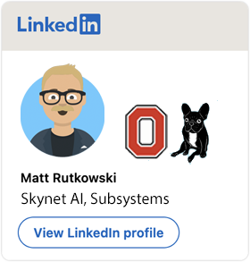

### Welcome! Hola! Hallo! Bonjour! Ciao! Cześć! Konnichiwa! Huānyíng!

<!--
**mrutkows/mrutkows** is a ✨ _special_ ✨ repository because its `README.md` (this file) appears on your GitHub profile.

<a class="badge-base__link LI-simple-link" href="https://www.linkedin.com/in/matt-rutkowski-b5545b5?trk=profile-badge">Matt Rutkowski</a>

-->

- 🔭 I’m primarily working on Apache OpenWhisk and Tekton projects in OSS
- 🌱 I’m currently learning Tekton pipeline controller, SPDX-compatible toolchains
- 👯 I’m looking to collaborate on CI/CD and Serverless projects for DevSecOps
- 🤔 I’m hoping to create reusable CI/CD workflows/profiles for DevSecOps
- 💬 Ask me about Ohio State! :o: :raised_hands: :heavy_exclamation_mark: :o:
- 📫 How to reach me: Email or Slack
- 😄 Pronouns: He/Him
- ⚡ Fun fact: Worked on Skynet AI in late 80s
